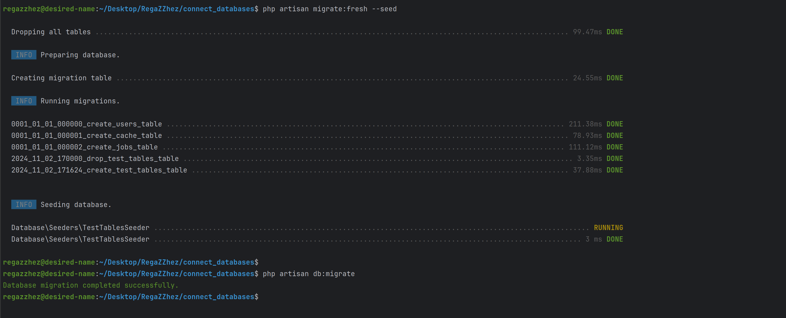
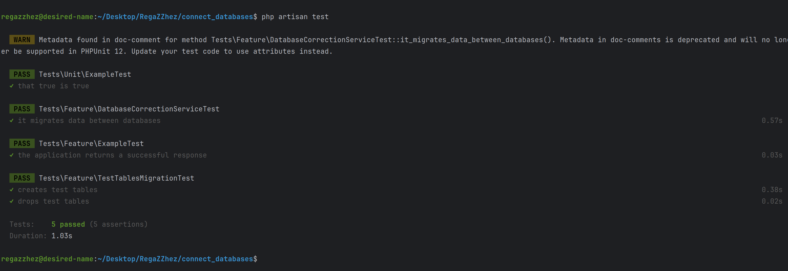

# Connect databases test task

## Описание задачи

Есть боевая и тестовая версия проекта. В ходе разработки в тестовую версию проекта внесены изменения, и надо эти изменения перенести на боевую версию.

**Задача:**  
Написать класс для коррекции второй базы данных по примеру первой. Первая БД - образец, вторая БД - которую надо скорректировать по первой БД. Вторая БД уже существует и имеет данные, которые нельзя повредить.

## Описание

Этот проект на Laravel 11 предназначен для миграции и синхронизации данных между двумя базами данных MySQL: `test_db` и `combat_db`. В проекте реализована возможность создания и удаления таблиц, а также переноса данных между базами.

## Установка

1. Убедитесь, что у вас установлены PHP 8.2 и Composer.
2. Склонируйте репозиторий
3. composer install
4. Настройте подключение к базам данных в файле .env

### Миграция и сидирование данных

-  php artisan migrate:fresh --seed

### Использование пользовательской команды

- php artisan db:migrate

 - результат команды
### Тестирование 

- php artisan test

 - результат тестов